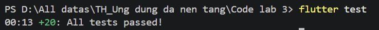

# Weather App

Flutter weather application for Chapter 4: API integration, geolocation, offline cache, favorites, search history, pull-to-refresh, and dynamic weather-based UI.

## Features

- Current weather by GPS or city search
- Hourly forecast for the next 24 hours
- Daily forecast derived from the 5-day / 3-hour OpenWeatherMap API
- Offline cache with stale-data indicator
- Search history and favorite cities
- Settings for temperature unit, wind speed unit, and 12/24-hour format
- Error handling for permission, network, rate limit, invalid city, and missing API key

## Tech Stack

- Flutter
- Provider
- OpenWeatherMap API
- `http`
- `geolocator`
- `geocoding`
- `shared_preferences`
- `connectivity_plus`
- `cached_network_image`

## Project Structure

```text
lib/
  config/
  models/
  providers/
  screens/
  services/
  utils/
  widgets/
test/
screenshots/
```

## API Setup

1. Create an OpenWeatherMap account and get an API key.
2. Copy `.env.example` to `.env` and add your real API key.
3. Run the app, or optionally override with a Dart define:

```bash
flutter run
```

Optional override:

```bash
flutter run --dart-define=OPENWEATHER_API_KEY=your_actual_key
```

This project reads the API key from `.env` first-class local setup and also supports `String.fromEnvironment('OPENWEATHER_API_KEY')` as an override.

## How To Run

1. Ensure Flutter SDK is installed.
2. If this folder does not yet contain generated platform directories, run:

```bash
flutter create .
```

3. Install packages:

```bash
flutter pub get
```

4. Run:

```bash
flutter run
```

## Testing

```bash
flutter test
```

## Screenshots

Place required screenshots in the `screenshots/` folder before submission.

## Known Limitations

- The free OpenWeatherMap 5-day forecast endpoint returns 3-hour intervals, so daily forecast cards are aggregated from those intervals.
- The project expects a valid OpenWeatherMap API key passed through `--dart-define`.
- Weather alerts, AQI, and home-screen widgets are not included in this baseline implementation.

## Future Improvements

- Add weather alerts and push notifications
- Add AQI integration
- Add multi-language support
- Add animated weather backgrounds
- Add widget support for Android and iOS

# Testing 


